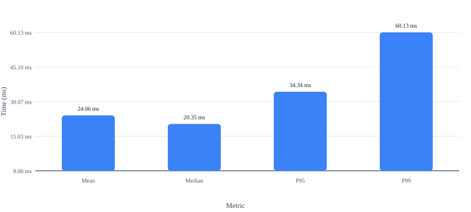
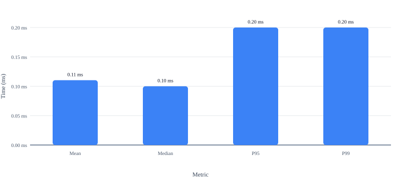
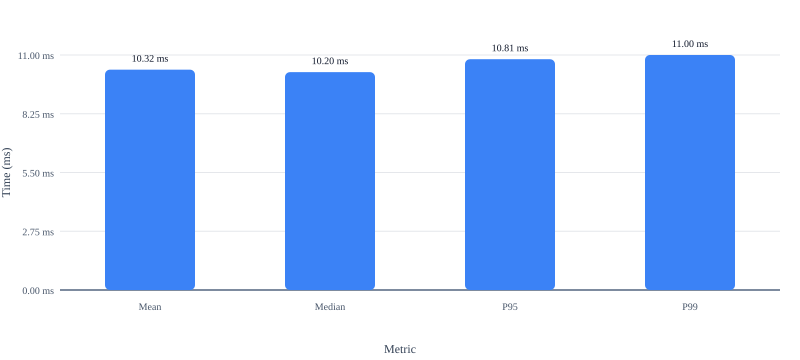
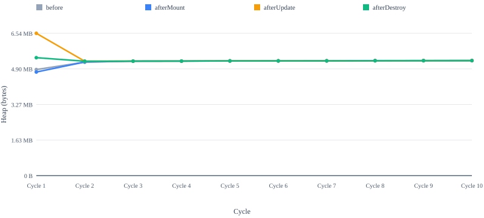
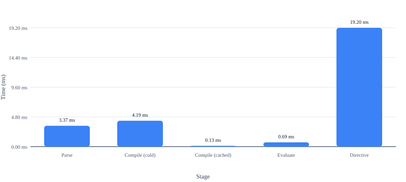
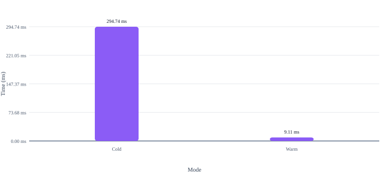

# Performance

This page documents the measured performance characteristics of **Udodi**.

Udodi is designed as a lightweight, fine-grained reactive UI runtime with no Virtual DOM. Its architecture emphasizes targeted updates, a compiled directive pipeline, minimal runtime overhead, and efficient use of browser primitives.

Performance, however, should not be reduced to a single number.

A runtime can be fast at mounting a large list while allocating excessively during updates. A compiler can perform well in isolation while contributing little to real application performance. A benchmark can produce an impressive average while hiding long-tail latency or cold-start costs.

For that reason, this page does not attempt to claim that Udodi is universally faster than every other UI runtime.

The goal is simpler:

> **Make Udodi's performance measurable, reproducible, and transparent.**

Every result published here is generated from benchmark code in the repository. The workloads, fixtures, measurement methodology, environment, and raw result files are available for inspection and reproduction.

The numbers should therefore be treated as **evidence about specific workloads**, not as universal performance guarantees.

---

## Performance philosophy

Udodi's performance work follows the same principles as the runtime itself:

- **Measure real architectural paths** rather than synthetic operations with little connection to application behaviour.
- **Separate cold and warm behaviour** where initialization or caching materially affects the result.
- **Measure distributions**, not just a single timing sample.
- **Prefer reproducible workloads** over one-off demonstrations.
- **Publish methodology and raw results** alongside summaries.
- **Track regressions over time** as the runtime evolves.
- **Avoid marketing comparisons without equivalent workloads and methodology.**

The purpose of the benchmark suite is therefore not to produce the smallest possible number.

It is to answer practical questions such as:

- How expensive is mounting a realistic component tree?
- How quickly can Udodi update a targeted part of the DOM?
- Does repeated updating cause heap growth?
- Does mount, update, and destroy leave memory behind?
- How expensive is the directive compiler pipeline?
- What is the difference between cold and cached compilation?
- What happens when component-scoped CSS is injected for the first time?
- How does the runtime behave after the relevant caches and browser paths are warm?

---

## Methodology

All timing and memory measurements on this page follow a consistent methodology.

Exact workloads may differ between benchmark suites. Each result file records the environment and benchmark-specific configuration used for that run.

### Environment

The benchmark environment is recorded with every result.

#### Recorded environment

| Property | Value |
| --- | --- |
| Browser | Chromium 151.0.7922.34 |
| Operating system name | Microsoft Windows 11 Home |
| Operating system version | 10.0.22621 |
| CPU | AMD Ryzen 9 5900HX with Radeon Graphics (16 logical cores) |
| Memory | 15.42 GiB |
| Architecture | x64 |
| Node.js | v24.15.0 |

The CPU and memory values describe the host machine running the benchmark process. The measured and warmup iteration counts below come from the Mount benchmark; individual benchmark result files may use different counts.

Typical fields include:

- Browser name
- Exact browser version
- Operating system
- Number of measured iterations
- Number of warmup iterations
- Benchmark-specific workload configuration

Unless explicitly stated otherwise:

- benchmarks run in Chromium through Playwright;
- benchmark pages are served locally;
- CPU throttling is not applied;
- browser and operating-system versions are recorded with the result;
- benchmark results should be reproduced on the same or a comparable environment before drawing fine-grained conclusions.

Browser performance is affected by many factors, including:

- CPU architecture and frequency scaling;
- operating-system scheduling;
- browser version;
- garbage-collection behaviour;
- JIT compilation;
- background processes;
- thermal conditions;
- browser internals.

Results from different machines should therefore not be treated as directly interchangeable.

### Timing benchmarks

Timing benchmarks use high-resolution `performance.now()` measurements.

A benchmark generally follows this structure:

```text
Warmup
   │
   ▼
Measured iteration
   │
   ▼
Collect sample
   │
   ▼
Repeat
   │
   ▼
Calculate statistics
```

Warmup iterations allow the runtime and browser to pass through initial execution paths before measured samples are collected.

Depending on the benchmark, warmup may account for:

- JavaScript JIT compilation;
- initial module execution;
- cache initialization;
- browser DOM internals;
- stylesheet initialization;
- first-use allocations.

Measured results may report:

- Mean
- Median
- Minimum
- Maximum
- Standard deviation
- p95
- p99

Batch-style benchmarks additionally report:

- operations per batch;
- total operations;
- mean time per batch;
- median time per batch;
- percentile time per batch;
- derived per-operation cost where meaningful.

#### Why distributions matter

A single timing result provides very little information.

For example:

```text
Run 1: 0.10 ms
Run 2: 0.11 ms
Run 3: 0.09 ms
Run 4: 4.80 ms
Run 5: 0.10 ms
```

The mean alone does not describe the occasional slow sample.

For this reason:

- median is useful for understanding typical behaviour;
- p95 shows the upper range experienced by most operations;
- p99 exposes rarer slow samples;
- maximum identifies the slowest observed sample;
- standard deviation helps describe variability.

No single statistic should be interpreted in isolation.

### Memory and heap benchmarks

Heap benchmarks measure allocation behaviour and memory retention across complete application lifecycles.

Measurements use V8's used JavaScript heap size after garbage collection at defined lifecycle checkpoints.

A typical lifecycle is:

```text
Forced GC
    │
    ▼
before
    │
    ▼
Mount application
    │
    ▼
Forced GC
    │
    ▼
afterMount
    │
    ▼
Perform updates
    │
    ▼
Forced GC
    │
    ▼
afterUpdate
    │
    ▼
Destroy application
    │
    ▼
Forced GC
    │
    ▼
afterDestroy
```

The checkpoints are:

| Checkpoint       | Meaning |
| ---------------- | ------- |
| **before**       | Heap baseline after garbage collection and before application creation. |
| **afterMount**   | Heap usage after the application has been mounted. |
| **afterUpdate**  | Heap usage after the benchmark's configured update workload. |
| **afterDestroy** | Heap usage after the application has been destroyed and garbage collection has run. |

Derived metrics include:

```text
mountIncrease       = afterMount − before
updateIncrease      = afterUpdate − afterMount
retained            = afterDestroy − before
retainedAfterUpdate = afterUpdate − before
```

#### Repeated lifecycle testing

A single mount, update, and destroy cycle is insufficient for detecting many retention problems.

The heap benchmark therefore repeats the lifecycle multiple times:

```text
Cycle 1
mount → update → destroy
        │
        ▼
Cycle 2
mount → update → destroy
        │
        ▼
Cycle 3
mount → update → destroy
        │
       ...
```

This makes it possible to distinguish:

- cold-start behaviour;
- one-time runtime initialization;
- temporary allocation;
- steady-state allocation;
- persistent memory retention;
- potential accumulation across repeated lifecycles.

A short delay follows forced garbage collection so that the heap can settle before the next measurement.

#### Interpreting heap measurements

Heap measurements require more care than timing measurements.

A negative value such as:

```text
mountIncrease = -20 KB
```

does not mean that mounting an application somehow consumes negative memory.

It means that the heap snapshot after mounting and garbage collection was lower than the earlier snapshot. Garbage collection may have reclaimed allocations that existed before the benchmark checkpoint.

Similarly, temporary growth during an update workload is not necessarily a memory leak.

For example:

```text
before       5.0 MB
afterMount   5.2 MB
afterUpdate  7.0 MB
afterDestroy 5.0 MB
```

The update phase may allocate substantial temporary memory while still returning close to baseline after destruction and garbage collection.

The most important long-term signal is therefore:

> Does retained memory after destroy remain low and stable across repeated cycles?

A steadily increasing retained series is more concerning than a single temporary allocation spike.

### Reproducibility

The benchmark harness lives in the repository under:

```text
benchmarks/
```

The suite includes dedicated workloads for:

- component mounting;
- single updates;
- batched updates;
- heap behaviour;
- DSL parsing;
- cold DSL compilation;
- cached DSL compilation;
- DSL evaluation;
- directive-heavy rendering;
- cold CSS scoping;
- warm CSS scoping.

Each benchmark produces machine-readable result data.

The performance report generator reads those result files and produces the tables and charts embedded in this document.

This means the page is not manually maintained as a collection of copied benchmark numbers.

The intended workflow is:

```text
Benchmark code
      │
      ▼
Playwright/browser execution
      │
      ▼
JSON results
      │
      ▼
Report generator
      │
      ├── Markdown tables
      │
      └── Charts
             │
             ▼
       performance.md
```

Re-running the benchmark suite and report generator refreshes the published results.

---

## Why these benchmarks?

Udodi is a fine-grained reactive UI runtime. Its important performance characteristics are therefore not limited to one synthetic operation.

The benchmark suite focuses on the paths most relevant to the runtime's architecture.

| Suite                | Purpose                                                                                     |
| -------------------- | ------------------------------------------------------------------------------------------- |
| Mount                | Measures the cost of creating and binding a realistic component tree containing 1,000 rows. |
| Update – Single      | Measures the cost of a targeted reactive update affecting a single row.                     |
| Update – Batched     | Measures repeated single-row updates performed in batches.                                  |
| Heap                 | Measures allocation and retention across repeated mount, update, and destroy lifecycles.      |
| DSL Parse            | Measures tokenization and parsing of directive expressions.                                 |
| DSL Compile – Cold   | Measures first-time directive compilation.                                                  |
| DSL Compile – Cached | Measures the instruction-cache hit path.                                                    |
| DSL Evaluate         | Measures execution of compiled instructions against a runtime context.                      |
| DSL Directive        | Exercises the directive pipeline through a realistic directive-heavy component workload.    |
| CSS Scope – Cold     | Measures first-use component style scoping and injection.                                   |
| CSS Scope – Warm     | Measures the same CSS path after relevant caches and browser state are warm.                |

Together, these workloads exercise the paths that matter most for Udodi's architecture:

- template and component creation;
- fine-grained reactive updates;
- list rendering;
- keyed reconciliation;
- directive compilation;
- VM instruction evaluation;
- cache behaviour;
- component lifecycle cleanup;
- memory retention;
- scoped style processing.

---

## Results

The tables and charts below are generated automatically from benchmark result files.

Re-run the benchmark suite and report generator to refresh this page.

The results describe the specific workloads used by the benchmark suite. They should not be interpreted as universal performance guarantees or as direct comparisons with another framework unless an equivalent workload and methodology are explicitly provided.

### Mount

This benchmark measures the time required for one mount of a component containing a realistic list of 1,000 rows. Each measured sample covers one complete mount, followed immediately by unmounting that instance.

The workload exercises component creation, template processing, reactive bindings, DOM creation, and list rendering.

Each row contains multiple bindings rather than representing a trivial empty-node benchmark.

The benchmark performs 10 warmup mount/unmount cycles, then records 50 measured mount samples. The warmup cycles are excluded from the reported timing statistics.

| Framework | Version | Operations | Warmup | Mean | Median | Min | Max | Std Dev | P95 | P99 |
| --- | --- | --- | --- | --- | --- | --- | --- | --- | --- | --- |
| Udodi | 1.1.0 | 1 mount of 1,000 rows | 10 iterations | 22.55 ms | 19.35 ms | 18.20 ms | 69.60 ms | 7.83 ms | 30.15 ms | 50.73 ms |



#### How to interpret this result

Mount performance represents the cost of building the initial application state.

It is particularly relevant to:

- initial page rendering;
- route changes;
- large component creation;
- rendering data-heavy views.

The result should be considered alongside update performance. A runtime may have a fast initial mount but perform poorly during targeted updates, or vice versa.

### Update – Single

This benchmark measures the cost of one targeted update to one row. Each `performance.now()` interval surrounds exactly one `app.update(...)` call, so the reported timing is already the time for a single update.

The benchmark performs 10 warmup updates, then records 1,000 measured single-update samples. Because `performance.now()` is quantized in this environment, individual samples may appear as values such as `0.00 ms`, `0.10 ms`, or `0.20 ms`. The `1,000` value describes the number of measured samples, not the number of updates represented by each sample.

| Framework | Version | Operations | Warmup | Mean | Median | Min | Max | Std Dev | P95 | P99 |
| --- | --- | --- | --- | --- | --- | --- | --- | --- | --- | --- |
| Udodi | 1.1.0 | 1 update per sample | 10 iterations | 0.11 ms | 0.10 ms | 0.00 ms | 1.40 ms | 0.07 ms | 0.20 ms | 0.20 ms |



#### What this measures

The benchmark primarily exercises:

```text
State change
     │
     ▼
Reactive dependency detection
     │
     ▼
Affected binding
     │
     ▼
Targeted DOM update
```

The benchmark is useful for evaluating whether an isolated state change causes unnecessary work outside the affected part of the UI.

### Update – Batched

This benchmark measures repeated single-row updates performed in succession, grouped into timed batches.

Warmup batches are excluded from the reported timing statistics. Therefore, the batch table reports the time for 100 updates per sample, while the workload contains 10,000 updates.

| Framework | Version | Operations | Warmup | Mean | Median | Min | Max | Std Dev | P95 | P99 |
| --- | --- | --- | --- | --- | --- | --- | --- | --- | --- | --- |
| Udodi | 1.1.0 | 100 updates per sample | 10 iterations | 10.83 ms | 10.85 ms | 10.00 ms | 14.00 ms | 0.41 ms | 11.10 ms | 11.33 ms |



#### Why batch updates?

A single update measures the latency of one targeted change. The batched benchmark measures the elapsed time for 100 such changes executed consecutively in one sample.

A repeated update workload additionally exposes:

- sustained reactive throughput;
- repeated allocation behaviour;
- dependency cleanup;
- scheduler overhead;
- cache effectiveness;
- performance degradation across many updates.

Batch-level results and per-update results should be interpreted separately. A fast per-operation average does not necessarily imply that every batch has identical latency.

### Heap Memory

The heap benchmark measures V8 used JavaScript heap size across repeated:

```text
mount
  ↓
update
  ↓
destroy
```

lifecycles.

The benchmark repeats this process across multiple cycles.

The first cycle is generally considered the cold cycle. Later cycles provide information about steady-state behaviour after one-time runtime and browser initialization has occurred.

| Cycle | Before | After Mount | After Update | After Destroy | Mount Δ | Update Δ | Retained |
| --- | --- | --- | --- | --- | --- | --- | --- |
| 1 | 4.87 MB | 4.76 MB | 6.54 MB | 5.42 MB | -117.23 KB | 1.78 MB | 557.39 KB |
| 2 | 5.21 MB | 5.22 MB | 5.25 MB | 5.25 MB | 4.99 KB | 36.97 KB | 42.63 KB |
| 3 | 5.26 MB | 5.26 MB | 5.26 MB | 5.26 MB | 1.01 KB | 760 B | 1.95 KB |
| 4 | 5.26 MB | 5.26 MB | 5.26 MB | 5.26 MB | 768 B | 548 B | 1.79 KB |
| 5 | 5.27 MB | 5.27 MB | 5.27 MB | 5.27 MB | 784 B | 548 B | 1.83 KB |
| 6 | 5.27 MB | 5.27 MB | 5.27 MB | 5.27 MB | 796 B | 548 B | 1.81 KB |
| 7 | 5.27 MB | 5.27 MB | 5.27 MB | 5.27 MB | 808 B | 548 B | 1.84 KB |
| 8 | 5.28 MB | 5.28 MB | 5.28 MB | 5.28 MB | 764 B | -400 B | 904 B |
| 9 | 5.28 MB | 5.28 MB | 5.28 MB | 5.28 MB | 840 B | 656 B | 2.14 KB |
| 10 | 5.28 MB | 5.28 MB | 5.28 MB | 5.28 MB | 780 B | 576 B | 1.85 KB |



#### What to look for

The most important signals are:

**Retained memory after destroy**

```text
retained = afterDestroy − before
```

This indicates how far the measured heap remains from the cycle baseline after the application has been destroyed and garbage collection has run.

A small retained value is generally preferable.

**Retained memory across cycles**

The series is often more informative than a single cycle.

A stable pattern:

```text
Cycle 1   2 KB
Cycle 2   1 KB
Cycle 3   3 KB
Cycle 4   2 KB
Cycle 5   2 KB
```

does not show the same concern as a persistent upward pattern:

```text
Cycle 1    2 KB
Cycle 2   10 KB
Cycle 3   25 KB
Cycle 4   40 KB
Cycle 5   60 KB
```

**Cold versus steady-state allocation**

The first cycle may include:

- JIT compilation;
- runtime initialization;
- browser initialization;
- cache creation;
- one-time allocation.

For this reason, a large first-cycle allocation should not automatically be interpreted as steady-state behaviour. Later cycles are useful for determining whether allocation stabilizes.

#### Notes

- Negative `mountIncrease` values can occur when garbage collection reclaims allocations between the `before` and `afterMount` snapshots. This is expected.
- Temporary heap growth during updates is not, by itself, evidence of a leak.
- Memory returning close to baseline after destroy is generally more important than temporary allocation during the workload.
- A steadily increasing retained-memory series is more concerning than a single high retained sample.
- Heap measurements are influenced by V8 and browser garbage-collection behaviour and should not be interpreted as exact object-level accounting.

### DSL Pipeline

Udodi directives are processed through a compiled pipeline.

Conceptually:

```text
Directive source
       │
       ▼
     Lexer
       │
       ▼
     Tokens
       │
       ▼
     Parser
       │
       ▼
      AST
       │
       ▼
    Compiler
       │
       ▼
 VM instructions
       │
       ▼
      VM
       │
       ▼
     Value
```

The DSL benchmarks isolate the individual stages of this pipeline.

| Stage            | What it measures                                                                       |
| ---------------- | -------------------------------------------------------------------------------------- |
| Parse            | Lexing and AST construction for representative directive expressions.                  |
| Compile – Cold   | First-time compilation of parsed directive expressions into VM instructions.           |
| Compile – Cached | Compilation cache-hit behaviour.                                                       |
| Evaluate         | Execution of compiled instructions against a runtime context.                          |
| Directive        | End-to-end directive processing within a realistic directive-heavy component workload. |

The expression fixtures include more than trivial scalar paths.

Representative expressions exercise:

- simple identifiers;
- nested property paths;
- numeric and string literals;
- boolean literals;
- method/function calls;
- multiple arguments;
- transform pipelines;
- chained transforms;
- conditional expressions;
- combinations of nested paths and transforms.

For example:

```text
name
user.profile.email
formatDate:createdAt:'yyyy-MM-dd'
value | trim | upper
isActive=>'active'
user.name | trim | capitalise
```

This helps ensure that the micro-benchmarks measure representative DSL paths rather than only the cheapest possible expression.

| Stage | Operations | Warmup | Mean | Median | Min | Max | Std Dev | P95 | P99 |
| --- | --- | --- | --- | --- | --- | --- | --- | --- | --- |
| Parse | 1,000,000 | 10 iterations | 3.37 ms | 3.30 ms | 3.10 ms | 8.10 ms | 609.21 µs | 3.51 ms | 6.22 ms |
| Compile (cold) | 1,000,000 | 0 iterations | 4.19 ms | 4.10 ms | 3.90 ms | 9.10 ms | 594.14 µs | 4.30 ms | 6.62 ms |
| Compile (cached) | 1,000,000 | 10 iterations | 126.00 µs | 100.00 µs | 0.00 µs | 400.00 µs | 68.73 µs | 200.00 µs | 301.00 µs |
| Evaluate | 1,000,000 | 10 iterations | 694.00 µs | 700.00 µs | 500.00 µs | 1.60 ms | 170.19 µs | 805.00 µs | 1.50 ms |
| Directive | 1,000,000 | 0 iterations | 19.20 ms | 17.85 ms | 15.10 ms | 29.00 ms | 3.68 ms | 27.14 ms | 28.71 ms |



#### Why isolate the DSL?

The directive pipeline is an important part of Udodi's architecture.

Isolating it makes it possible to detect regressions in:

- the lexer;
- parser;
- compiler;
- instruction cache;
- VM evaluator.

For example, a change that improves component-level performance while accidentally doubling parser cost can still be detected.

#### Micro-benchmarks are not application benchmarks

DSL results should not be compared directly with mount or update timings.

A result measured in nanoseconds per operation does not imply that an entire component renders in nanoseconds.

Real UI workloads involve additional costs such as:

- DOM creation;
- DOM mutation;
- browser layout;
- style calculation;
- list reconciliation;
- event handling;
- reactive dependency management.

The dominant cost in a real application is frequently DOM or browser work rather than parsing or compilation.

The DSL benchmarks are therefore best used to track the efficiency of the compiler/runtime pipeline and detect regressions in its hot paths.

### CSS Scoping

Udodi supports component-scoped styles.

The CSS benchmark separates cold and warm behaviour because style processing can have significantly different characteristics depending on whether the relevant runtime and browser paths have already been initialized.

#### Cold

The cold benchmark measures component-scoped style processing under fresh or first-use conditions.

| Framework | Version | Operations | Warmup | Mean | Median | Min | Max | Std Dev | P95 | P99 |
| --- | --- | --- | --- | --- | --- | --- | --- | --- | --- | --- |
| Udodi | 1.1.0 | 30 | 0 iterations | 294.74 ms | 293.20 ms | 282.70 ms | 328.40 ms | 9.36 ms | 310.02 ms | 324.05 ms |

#### Warm

The warm benchmark measures the same general path after relevant initialization and caching have occurred.

| Framework | Version | Operations | Warmup | Mean | Median | Min | Max | Std Dev | P95 | P99 |
| --- | --- | --- | --- | --- | --- | --- | --- | --- | --- | --- |
| Udodi | 1.1.0 | 30 | 1 iterations | 9.11 ms | 8.35 ms | 4.30 ms | 16.80 ms | 3.91 ms | 15.78 ms | 16.60 ms |



#### Why separate cold and warm results?

Combining them into a single average can hide an important distinction.

For example:

```text
Cold operation
      │
      ▼
Initial parsing / processing
Cache initialization
Browser stylesheet work

Warm operation
      │
      ▼
Reuse existing paths
Less initialization
```

Both measurements are useful.

Cold performance is relevant to:

- first component creation;
- first-use initialization;
- applications that create many unique style definitions.

Warm performance is relevant to:

- repeated component creation;
- reuse of existing scoped styles;
- steady-state application behaviour.

The benchmark should therefore report both rather than allowing one result to hide the other.

#### Interpreting CSS scope results

CSS scoping results depend heavily on the workload.

Factors include:

- number of components;
- number of selectors;
- total stylesheet size;
- number of unique style definitions;
- browser stylesheet processing;
- whether style work can be reused.

These results should therefore be interpreted as measurements of the published benchmark workload rather than a universal cost for all CSS.

---

## Interpreting the numbers

Performance results are easiest to misinterpret when reduced to a single ranking.

The following guidelines apply throughout this page.

### Lower is better for timing

For timing benchmarks:

```text
0.10 ms < 0.50 ms
```

means the first measured operation completed faster under the benchmark conditions.

### Prefer distributions over a single sample

A benchmark should not be judged by one unusually good run.

Prefer:

- median for typical behaviour;
- p95 for upper-range behaviour;
- p99 for rarer slow samples;
- standard deviation for variability.

A low mean with a high p99 can indicate occasional slow operations that the average hides.

### Separate cold and steady-state behaviour

First-use costs can differ substantially from repeated execution.

Where applicable, distinguish:

```text
Cold
  │
  ├── initialization
  ├── JIT compilation
  ├── cache creation
  └── first-use browser work

Warm
  │
  ├── initialized runtime
  ├── populated caches
  └── repeated execution
```

Neither result should be hidden.

### Heap growth is not automatically a leak

Temporary allocation is normal.

The important question is:

> What remains after the workload has completed, the application has been destroyed, and garbage collection has run?

Repeated lifecycle testing provides stronger evidence than a single heap snapshot.

### Look for trends, not isolated spikes

An isolated outlier may result from:

- garbage collection;
- JIT activity;
- browser scheduling;
- operating-system activity;
- measurement noise.

A persistent trend across repeated cycles is generally more informative.

This applies to both timing and memory.

### Do not compare unrelated workloads

A DSL evaluation result should not be compared directly with:

- component mount time;
- DOM update time;
- CSS scoping time.

They measure different parts of the runtime.

Likewise, framework comparisons are meaningful only when:

- the workload is equivalent;
- the data size is equivalent;
- the browser environment is equivalent;
- the implementation strategy is disclosed;
- warmup methodology is equivalent;
- the benchmark code is publicly available.

---

## What these benchmarks do not prove

These benchmarks do not prove that Udodi is the fastest framework for every application.

They do not measure every possible application characteristic.

For example, benchmark results may not directly represent:

- complex application routing;
- network latency;
- server rendering;
- hydration;
- extremely large application architectures;
- animation-heavy interfaces;
- browser layout and paint bottlenecks;
- third-party component libraries;
- application-specific business logic.

Performance depends on the application.

The benchmark suite provides evidence about specific runtime characteristics under defined workloads.

---

## Reproducing the results

Move to the benchmarks folder:

```bash
cd benchmarks
```

Install the project dependencies:

```bash
npm install
```

Run the benchmark suite:

```bash
npm run benchmark
```

Regenerate the performance report:

```bash
npm run benchmark:report
```

The benchmark runner executes the configured workloads and writes machine-readable result files.

The report generator then:

- reads the benchmark result files;
- extracts benchmark metadata and measurements;
- generates Markdown tables;
- generates charts;
- replaces the corresponding placeholders in this document.

### Generated result files

Benchmark results are stored alongside their respective benchmark suites.

A typical result contains information such as:

```text
framework
    ├── name
    └── version

benchmark
    ├── name
    └── unit

environment
    ├── browser
    ├── browserVersion
    ├── os
    ├── iterations
    └── warmupIterations

measurements
    ├── samples
    ├── statistics
    ├── workload configuration
    └── benchmark-specific metrics
```

The exact schema may differ between benchmark categories.

This is intentional, because a heap benchmark needs lifecycle checkpoints and retention metrics, while a DSL micro-benchmark needs operation counts and per-operation timing.

The report generator should preserve those differences rather than forcing unrelated benchmarks into one generic schema.

### Using the results for regression tracking

The benchmark suite is also intended to support performance regression detection.

When Udodi changes, the benchmark results can answer questions such as:

- Did mount time regress?
- Did targeted updates become slower?
- Did the DSL compiler cache become less effective?
- Did VM evaluation regress?
- Did CSS scoping become more expensive?
- Did repeated updates begin retaining memory?
- Did lifecycle cleanup stop returning close to baseline?

A single benchmark result is useful.

A history of results across releases is more useful.

As the measurement infrastructure matures, representative workloads can be incorporated into automated regression checks where practical.

---

## Reporting performance honestly

The preferred interpretation of this page is:

> Under the documented workload, on the recorded environment, Udodi produced these measurements.

Not:

> Udodi will always be this fast.

Benchmark numbers are environment-dependent.  
Application performance is workload-dependent.  
Browser behaviour changes over time.

The benchmark code is therefore as important as the number it produces.

If a result appears surprising, the workload should be inspected.  
If a result cannot be reproduced, the methodology should be investigated.  
If a future version regresses, the regression should be visible rather than hidden.

That is the purpose of publishing the methodology and raw measurements.

---

## Version

Results on this page were generated for **Udodi 1.1.0** unless otherwise noted in an individual result table.

*Last generated: 2026-09-03 10:41:40.323 UTC*
